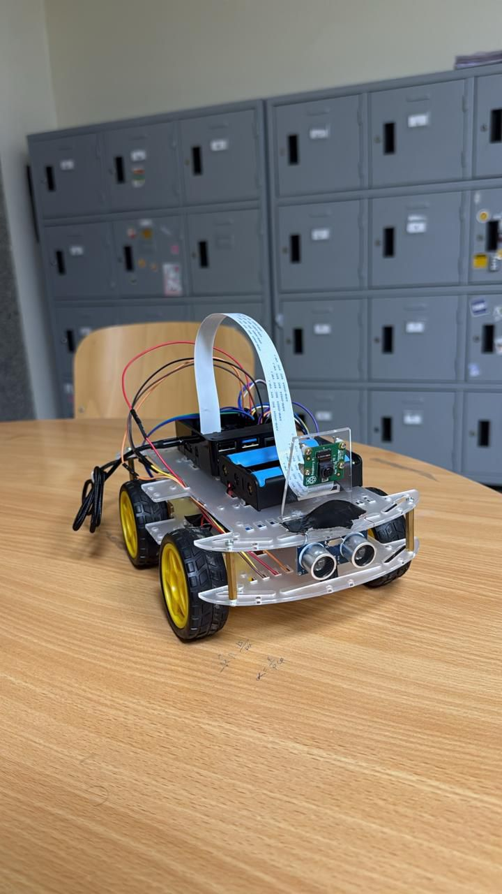
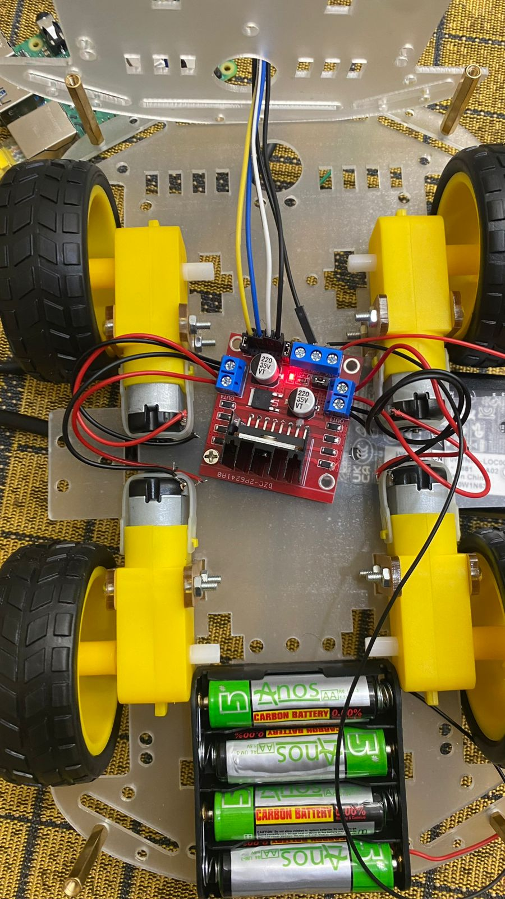
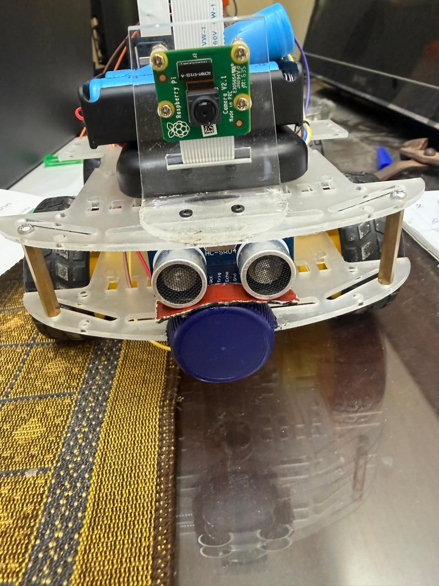
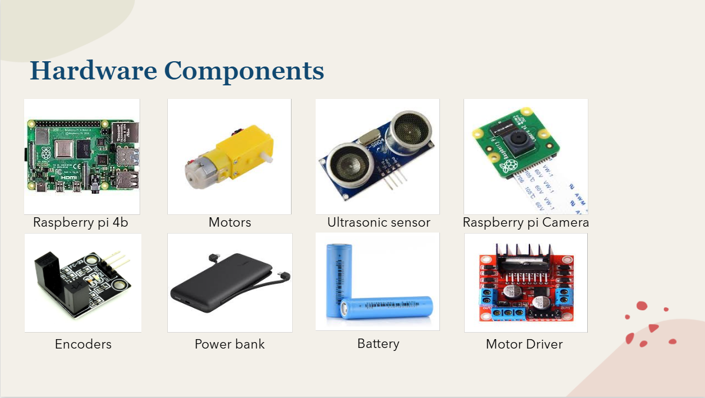
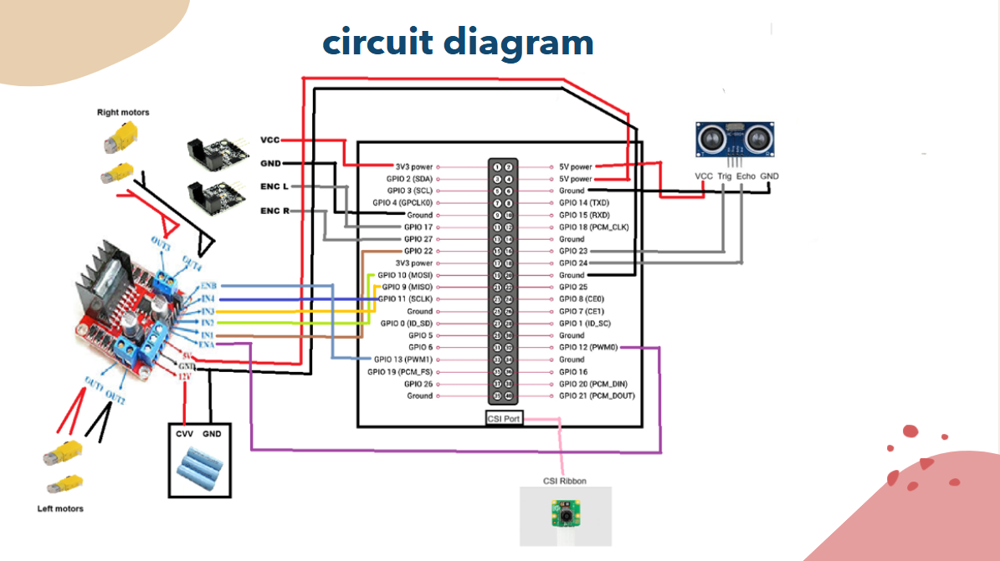
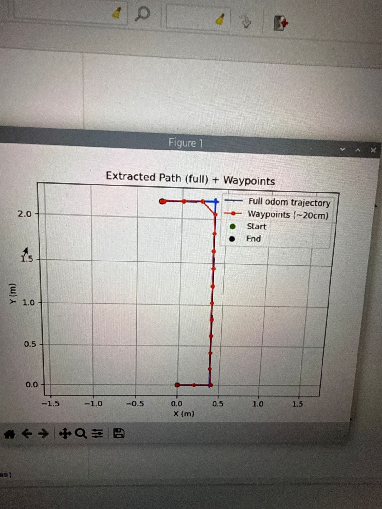
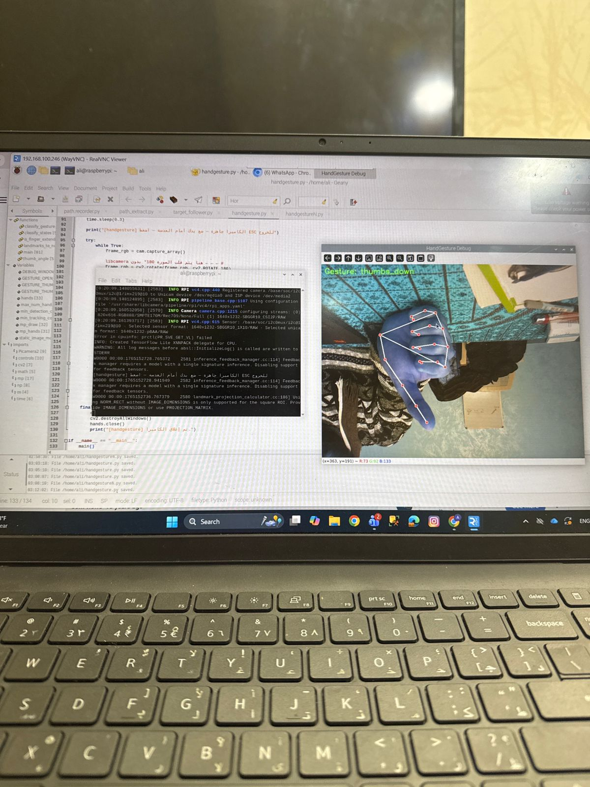
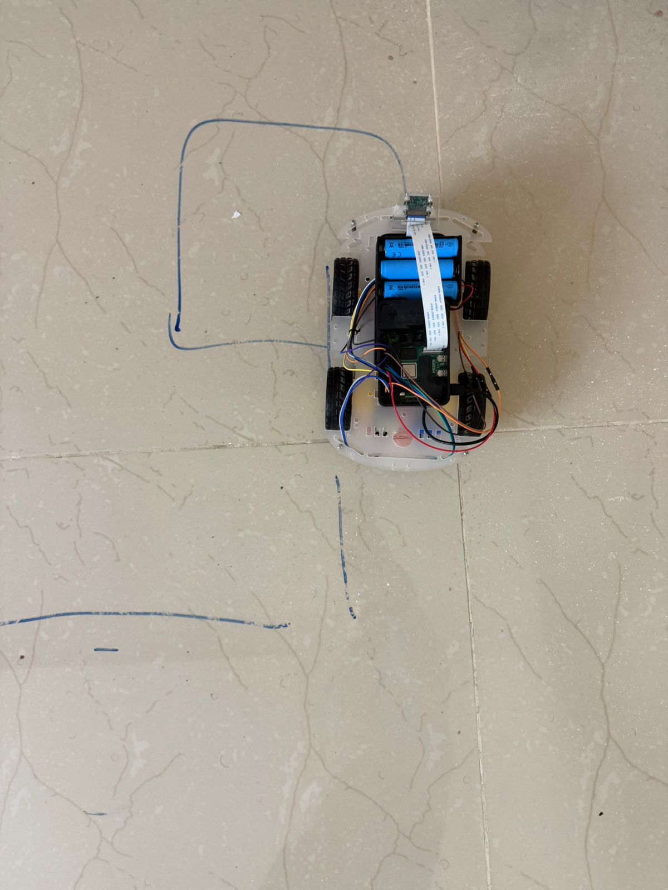

# Intelligent Mobile Robot  
Autonomous Mobile Robot with Teach-and-Repeat Navigation, Odometry, Computer Vision & Gesture Control  

---

## 1. Project Overview

This project presents a fully integrated intelligent mobile robot built using Raspberry Pi 4B.  
The system combines embedded systems, robotics, control engineering, and computer vision into a single modular architecture.

The robot is capable of:

- Recording a trajectory using wheel odometry (Teach Phase)
- Extracting optimized waypoints from recorded path
- Repeating the learned path autonomously (Repeat Phase)
- Detecting obstacles using ultrasonic sensor
- Performing gesture-based control using MediaPipe
- Capturing and processing real-time video using Raspberry Pi Camera

This project demonstrates real-world robotics system integration — not simulation.

---

## 2. System Philosophy

The robot follows a Teach-and-Repeat paradigm:

1. Human manually drives robot → system records full odometry trajectory.
2. Recorded trajectory is processed and compressed into waypoints.
3. Robot autonomously follows those waypoints using heading control.
4. Safety layer (ultrasonic sensor) prevents collisions.

The architecture is modular and designed for clarity, debugging, and extension.

---

## 3. Robot Overview

  

---

## 4. Mechanical & Hardware Setup

### Bottom View (Motors + Driver)

  

### Front View (Ultrasonic + Camera)

  

---

## 5. Hardware Components

  

Main Components:

- Raspberry Pi 4B (Main controller)
- Raspberry Pi Camera Module
- L298N Motor Driver
- 4x DC Motors
- Wheel Encoders
- Ultrasonic Sensor (HC-SR04)
- 18650 Battery Pack (motors)
- Power Bank (Raspberry Pi supply)

---

## 6. Circuit Diagram

  

The circuit integrates:

- GPIO PWM control for motors
- Encoder input reading
- Ultrasonic trigger/echo pins
- Camera CSI interface
- Independent power routing for motors and Pi

---

## 7. Software Architecture

The project is organized into modular Python files:

- path_recorder.py        → Records full odometry trajectory
- path_extract.py         → Extracts waypoints from recorded path
- target_follower.py      → Autonomous waypoint navigation
- motor_control.py        → PWM motor control logic
- camera.py               → Camera interface
- config.py               → System configuration parameters

Each module is executed independently for better debugging and clarity.

---

## 8. Execution Flow

The system runs in three stages:

### Stage 1 – Recorder
Manually drive the robot.
The system logs:
- X position
- Y position
- Heading (theta)
- Timestamp

Data is saved as CSV.

### Stage 2 – Path Extraction
- Reads full trajectory
- Samples every fixed distance (e.g., 20 cm)
- Generates waypoint list
- Outputs reduced waypoint file

This reduces noise and computational load.

### Stage 3 – Autonomous Follower
- Loads waypoint file
- Computes heading error
- Applies proportional control
- Adjusts motor speeds
- Stops if ultrasonic detects obstacle

---

## 9. Path Visualization

  

The plot shows:
- Full recorded odometry path
- Extracted waypoints
- Start & End positions

---

## 10. Gesture-Based Control (Computer Vision)

  

MediaPipe is used for:
- Hand landmark detection
- Gesture classification
- Mapping gestures to motion commands

This enables real-time AI-based interaction.

---

## 11. Real Path Execution

  

Robot successfully repeats learned trajectory using:
- Differential drive kinematics
- Heading correction control
- Waypoint navigation strategy

---

## 12. Control & Robotics Concepts Implemented

- Differential Drive Kinematics
- Wheel Odometry Estimation
- Waypoint-Based Navigation
- Proportional Heading Control
- Real-Time PWM Motor Control
- Obstacle Avoidance Safety Layer
- Computer Vision Gesture Recognition
- Embedded GPIO Interfacing
- Data Logging & Trajectory Reconstruction

---

## 13. Safety Layer

The ultrasonic sensor continuously measures front distance.

If obstacle distance < threshold:
- Motors immediately stop
- Control loop pauses
- Robot resumes only when safe

This prevents collision during autonomous repeat.

---

## 14. System Strengths

- Modular architecture
- Clear separation of stages
- Real embedded hardware execution
- AI + Robotics integration
- Reproducible teach-and-repeat system
- Clean data pipeline

---

## 15. Limitations

- No SLAM (pure odometry-based)
- Accumulated drift possible
- Simple proportional controller (no PID yet)
- Indoor structured environment

---

## 16. Future Improvements

- PID heading controller
- IMU sensor fusion
- EKF-based localization
- SLAM integration
- ROS2 migration
- Web dashboard monitoring
- Cloud telemetry logging

---

## 17. Author

Computer Engineering Student  
Focus: Embedded Systems, Robotics, AI Systems  

This project represents a complete embedded robotics system integrating hardware, control logic, and AI-based perception.

## Video

[▶ Watch Demo Video](https://www.youtube.com/shorts/t58b5VQeN5I?feature=share)

